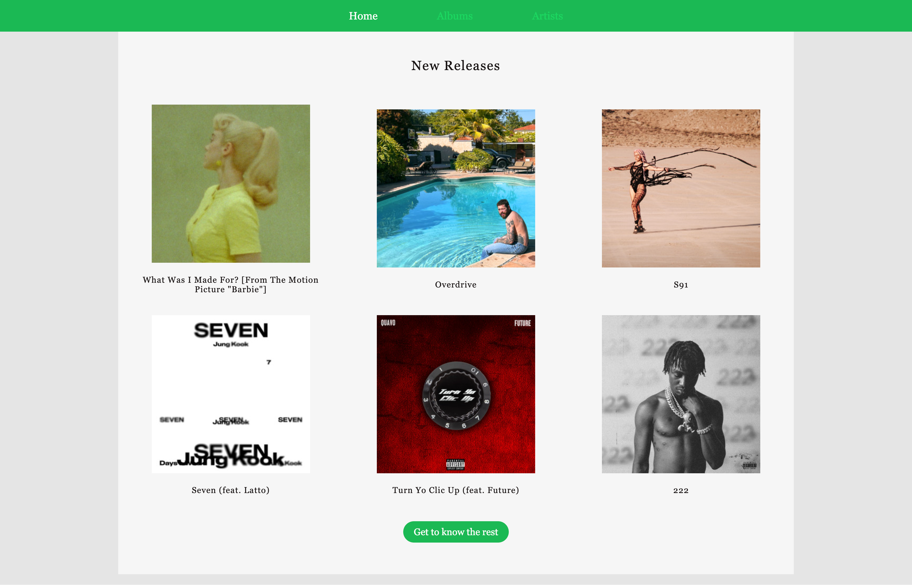

# Code the Dream Pre-work for advanced classes

_Description_

**The project fetches data from [Spotify](https://beta.developer.spotify.com/documentation/web-api/), a music API that requires a free Spotify account and use of an access token.
**Technologies used include: vanilla JavaScript, HTML, CSS.

## Demo

The site is live and can be viewed at https://codewithdream-spotify-prework.netlify.app/index.html

## To run the project locally run:

1. Clone the repo:

   git clone git@github.com:yuliahar/codewithdream-prework.git

2. Navigate into the directory:

   cd codewithdream-prework

3. Open `index.html` in a browser, or use the LiveServer plugin in VSCode.

### Models used

_**Albums Model**_ - GET New Releases ([API Reference](https://developer.spotify.com/documentation/web-api/reference/get-new-releases)): Retrieves a list of new album releases featured on Spotify.
_**Album Details**_ - GET an Album ([API Reference](https://developer.spotify.com/documentation/web-api/reference/get-an-album)): Retrieves Spotify catalog information for a single album.
_**Search Artists Model**_ - [API Reference](https://developer.spotify.com/documentation/web-api/reference/search): Retrieves Spotify catalog information about albums, artists, playlists, tracks, shows, episodes, or audiobooks that match a keyword string.
_**Artists Model**_ - GET an Artist ([API Reference](https://developer.spotify.com/documentation/web-api/reference/get-an-artist)): Retrieves Spotify catalog information for an artist.

### Functionality

- The home page displays six newly released albums in the US. Users can navigate to the full list of new releases by clicking the button [Get to know the rest] or using the navigation menu.
- Each album is clickable and can be opened by clicking the album's image or name.
- To see the most popular rock artists, users can navigate to the [Artists] page through the navigation menu.
- Each artist is clickable and can be opened by clicking the artist's image or name.

